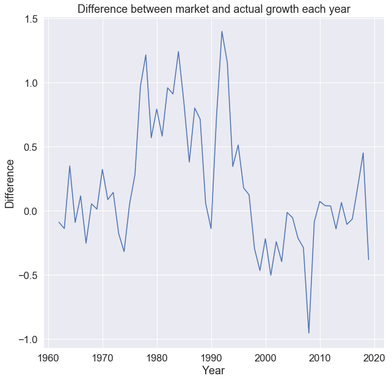

# expectationsinvesting
Georgia Tech, CS 7641 - Machine Learning, Spring 2020 Final Project

Hi! This is our team's project for Georgia Tech's Machine Learning Class. We created models for expectation investing.

 
